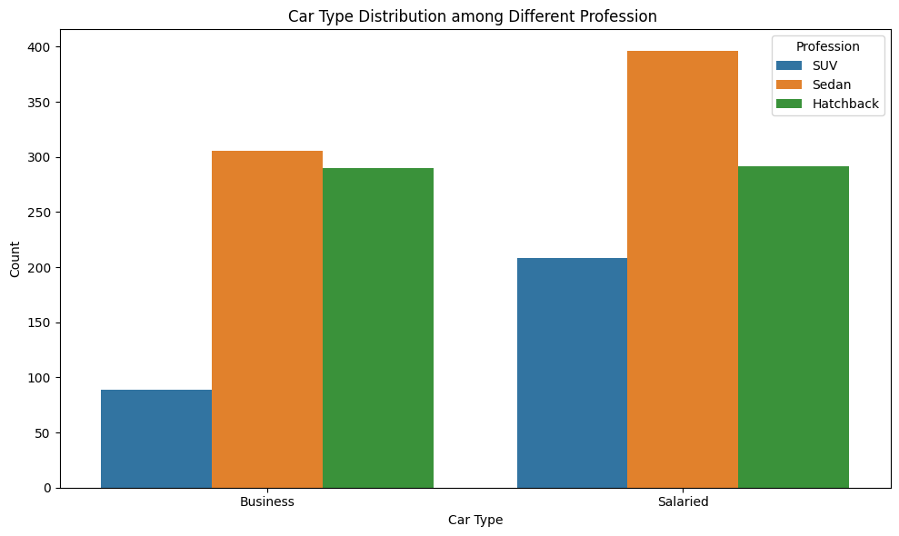
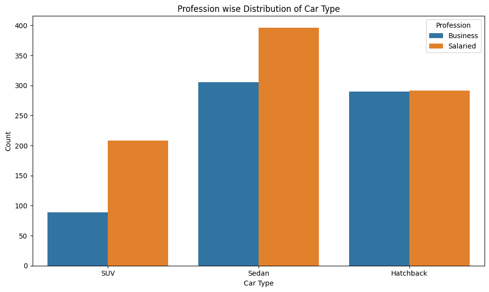

# Automobile Sales Data Insights


> **Data Science Project | Optimizing Marketing Campaigns & Customer Experience for Austo Motor Company**

---

## Table of Contents
- [Project Overview](#project-overview)
- [Business Problem](#business-problem)
- [Dataset](#dataset)
- [Methodology](#methodology)
- [Key Results](#key-results)
- [Business Impact](#business-impact)
- [Skills](#skills)
- [Key Learnings](#key-learnings)
- [Repository Structure](#repository-structure)
- [How to Run](#how-to-run)
- [Future Improvements](#future-improvements)
- [Author](#-author)

---

## Project Overview
**Austo Motor Company**, a leading manufacturer of SUVs, Sedans, and Hatchbacks, is looking to enhance its marketing efficiency. This project analyzes customer data to understand demand patterns, refine customer segmentation, and provide data-driven recommendations to improve campaign performance and customer experience.

👉 [Open the notebook to explore full analysis](notebook/automobile_sales_data_insights_analysis.ipynb)

## Business Problem
The board of Austo Motor Company raised concerns about the **efficiency of the current marketing campaign**. The key objectives are:
- > Reduce marketing waste by targeting the right audience.
- > Identify high-value customer segments.
- > Understand product preferences (SUV vs. Sedan vs. Hatchback) based on demographics.
- > Provide actionable insights to improve sales and customer retention.

## Dataset
The dataset contains customer demographic and financial details.
- **Source:** Internal Company Data (Austo Motor Company)
- **Size:** ~1,600 Records
- **Key Features:**
  - `Age`, `Gender`, `Marital Status`, `Profession`, `Education`
  - `Salary`, `Partner Salary`, `Total Salary`
  - `No. of Dependents`, `Partner Working`
  - `Personal Loan`, `House Loan` (Financial Liabilities)
  - `Price`, `Make` (Target Variables)

## Methodology
1. **Data Cleaning:** Handling missing values, correcting data types, and removing duplicates (e.g., standardizing 'Femal'/'Femle' to 'Female').
2. **Exploratory Data Analysis (EDA):** Univariate and Bivariate analysis to uncover patterns in age, salary, and car preferences.
3. **Feature Engineering:** Creating new features like `Total_Salary` to better assess purchasing power.
4. **Customer Profiling:** Segmenting customers based on profession, family size, and income to map them to specific car types.
5. **Insights Generation:** Deriving business-centric conclusions from the data patterns.

## Key Results
- **Income Influence:** Higher `Total_Salary` strongly correlates with purchasing **SUVs**, while entry-level buyers prefer **Hatchbacks**.
- **Demographics:** 
  - **Sedans** are popular among middle-aged, salaried professionals.
  - **SUVs** are preferred by customers with larger families and higher disposable income.
- **Gender Trends:** Distinct preferences were observed, with significant insights into female buyers' growing market share in specific segments.

## Business Impact
1. **Targeted Marketing:** Shift ad spend for SUVs towards high-income, married professionals with dependents.
2. **Product Positioning:** Position Hatchbacks as the ideal "first car" for young, single professionals or students.
3. **Loan Offers:** Partner with banks to offer tailored financing for customers with existing liabilities (House/Personal loans), as they show high intent but price sensitivity.

## Skills
### Technical Skills


### Soft Skills


## Key Learnings
- **Customer Segmentation:** Learned how detailed demographic profiling (Age, Family Size) directly impacts product choice.
- **Data storytelling:** The importance of framing analysis in the context of business problems (e.g., "Marketing Efficiency" vs just "Sales Stats").
- **Feature Engineering:** How creating composite features like `Total_Salary` can reveal stronger correlations than individual metrics.
- **Python for Analysis:** Deepened proficiency in `pandas` for data manipulation and `seaborn` for multivariate analysis.


## Future Improvements
- [ ] **Predictive Modeling:** Build a classification model to predict which car type a new customer is likely to buy.
- [ ] **Dashboarding:** Create an interactive Tableau or PowerBI dashboard for the marketing team.
- [ ] **External Data:** Integrate macroeconomic data to see how inflation impacts car sales.

## Project Visualizations


*Car Type Distribution.*


*Profession wise Distribution.*

## Repository Structure
```
automobile-sales-data-insights/
│
├── data/
│   └── automobile.csv        # dataset
│   
│
├── notebooks/
│   └── automobile_sales_data_insights_analysis.ipynb        # Main ipynb notebook
│
│
├── requirements.txt          # Python dependencies
├── LICENSE
└── README.md                 # Project documentation
```


## 👨‍💻 Author
 **Nabankur Ray** 
 
 Passionate about real-world data-driven solutions
 
 [](https://github.com/nabankur14) [](https://www.linkedin.com/in/nabankur-ray-876582181/) 
 


⭐ If you like this project

Give it a ⭐ on GitHub — it helps a lot!